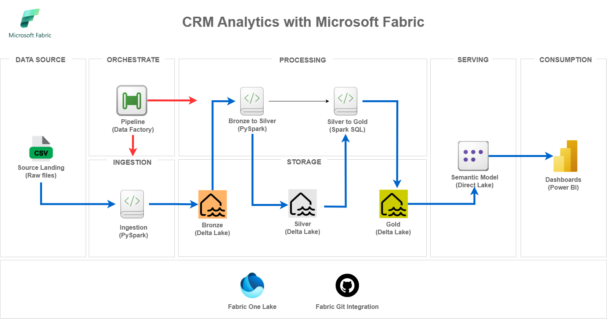

# 📊 CRM Analytics with Microsoft Fabric

A modern and secure **CRM Analytics architecture** using Microsoft Fabric. All data is stored in OneLake, enabling seamless integration between engineering and analytics environments without data duplication. The project enforces governance best practices, applying RBAC and the Principle of Least Privilege, with isolated environments ready for CI/CD. Data pipelines are fully automated with PySpark, from ingestion to delivery, and Power BI reports connect directly to the Lakehouse for high performance.

> 🎥 [View Demo (Video)](https://link-to-demo) *(optional)*  

---

## 🚀 Architecture
   

**Flow:**
1. **Source Landing** → Raw CSV files stored in OneLake  
2. **Bronze Layer** → Raw data in Delta Lake format (no transformations)  
3. **Silver Layer** → Cleaned and standardized data with dimensions and facts  
4. **Gold Layer** → Business-ready datasets for dashboards and analytics

---

## 🛠 Technologies
- **Microsoft Fabric** – Integrated platform for data, analytics, and AI  
- **Lakehouse (Delta Lake)** – Unified storage with data versioning and optimizations  
- **PySpark** – Distributed data processing and transformations  
- **Fabric Pipelines** – ETL orchestration and automation  
- **Power BI** – Data visualization and dashboarding  
- **Python (Faker, requests)** – Synthetic data generation and API ingestion  
- **Spark SQL / DAX** – Querying and modeling
  
---

## ⚙️ Pipeline & Modeling

**Pipelines:**
- `[pipeline_name]` → Short description of what it does  
- `[pipeline_name]` → Short description  

**Data Model:**
```plaintext
Layer1: table1, table2, table3
Layer2: table1, table2, table3
Layer3: table1, table2, table3
```

---

## 📊 Results / Dashboards

| Insight | Description |
|---------|-------------|
| 📌 **Insight 1** | *[Explain the key finding, trend, or metric discovered. Be concise.]* |
| 📌 **Insight 2** | *[Highlight another significant observation from the analysis.]* |
| 📌 **Insight 3** | *[Present a critical business or technical takeaway.]* |

**Example Dashboard:**

*(Replace with your own dashboard image or link to an interactive version.)*

---

## 📝 How to Run

```bash
# 1️⃣ Clone this repository
git clone https://github.com/danillobsoliveira/executive-analytics-fabric-powerbi.git
cd executive-analytics-fabric-powerbi

# 2️⃣ Set up environment (Python example)
python -m venv .venv
source .venv/bin/activate  # On Windows use `.venv\Scripts\activate`
pip install -r requirements.txt

# 3️⃣ Execute pipelines / notebooks
# Adjust the command according to your stack
python run_pipeline.py

# 4️⃣ View results
# Provide instructions to open dashboard or report
```

---

## 📄 License
This project is licensed under the **MIT License** – see [LICENSE](./LICENSE) for details.

---

**Author:** Danillo Oliveira  
**LinkedIn:** https://www.linkedin.com/in/danillobsoliveira/ 
