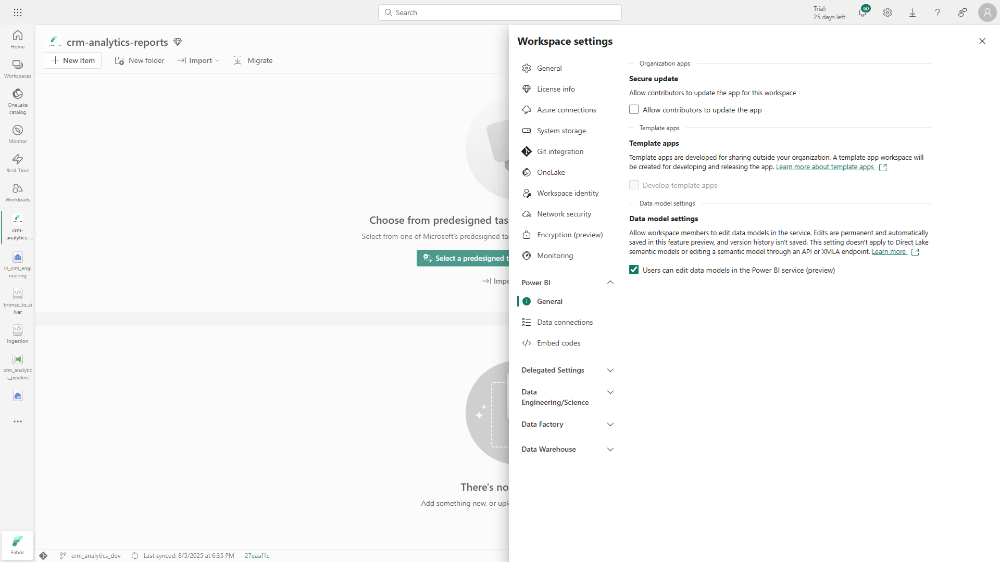

# Building a Medallion Architecture for CRM Analytics in Microsoft Fabric

> This project implements a Medallion Architecture in a Microsoft Fabric Lakehouse to support CRM Analytics. It includes the creation of a workspace and lakehouse, ingestion of CRM data into the Bronze layer, transformation into the Silver layer with cleaned and standardized tables, further modeling into the Gold layer using a dimensional star schema, and the development of a semantic model to create relationships and KPIs in Power BI.

> ###### **Note:** This is a portfolio project built to demonstrate modern data engineering practices using Microsoft Fabric. All datasets are synthetic and generated for demonstration purposes.
 

## Create workspaces

In this project, dedicated workspaces are created in Microsoft Fabric to support the **Medallion Architecture** (Bronze → Silver → Gold) and enforce proper governance.
* **Engineering Workspace:** Hosts the **Bronze, Silver, and Gold layers**, managed by the engineering team. All raw and curated data resides here, including the Gold tables ready for analytical consumption.
* **Analytics Workspace:** Hosts the **semantic model** and **Power BI reports**. Analysts access the Gold layer from the Engineering Workspace via **Lakehouse Shortcuts** or **Direct Lake connections**, avoiding data duplication.

### Creating the Engineering Workspace

1. Navigate to the Microsoft Fabric home page in a browser and sign in with your Fabric credentials.
2. In the left-hand menu, select **Workspaces** (icon looks like 🗇).
3. Create a new workspace named **crm-analytics-engineering**.
4. In the **Advanced section**, select a licensing mode that includes Fabric capacity (Trial, Premium, or Fabric).
5. Once created, the workspace opens empty and is ready to host **Bronze, Silver, and Gold** layers, pipelines, and notebooks.

### Creating the Analytics Workspace

1. Repeat the steps to create the **crm-analytics-reports** workspace for analysis.
2. This workspace will host **Power BI datasets and semantic models**.
3. Analysts access the Gold data from the Engineering Workspace via **Lakehouse Shortcuts**, enabling safe and governed access without duplicating data.
4. Access the **workspace settings** and confirm that the **Data Model Settings** preview feature is turned on. This setting allows you to define **relationships between lakehouse tables** and build a Power BI semantic model.

   

